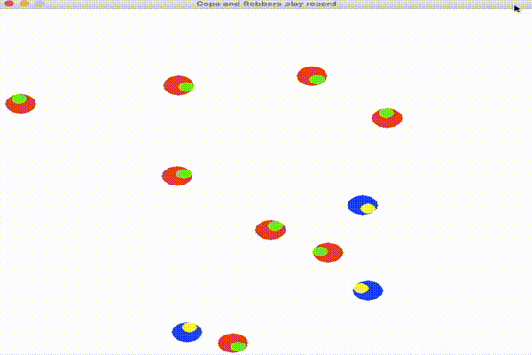
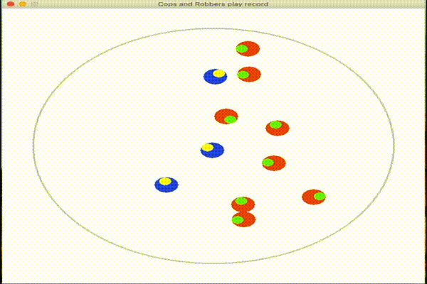
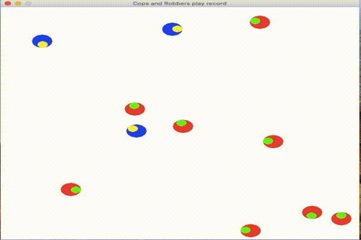
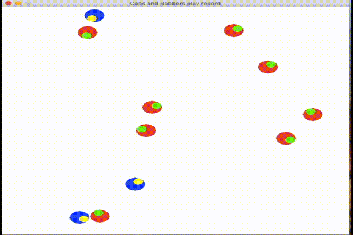
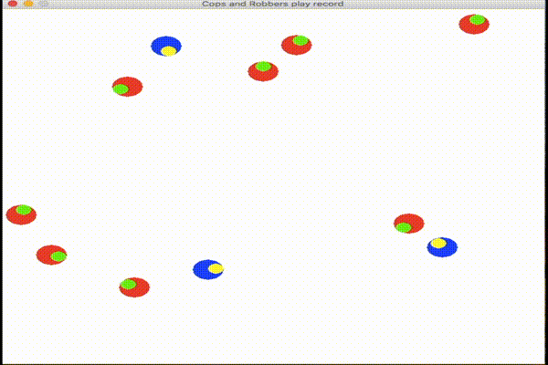

# CAR
You can play cops and robbers game.

## animation

## install
python3, pygame,math,random
## how to run
* install python3, pygame, math, random
* in CAR directory, $python3 main.py
## what you can do
* You can run main.py
* You can change screen size, environment, the number of cops and robbers.And you can change some parameter, in constant.py
* You can play as a cop or robber. Change 'your_player' in constant.py . Button 'g'or'↑'=move, '→'=turn right, '←'=turn left,
* You can change the algorithm of cops and robbers move. in main.py line 54 - 59
* You can make the algorithm of cops and robbers move.You had better watch the example 'next_action.py'
* You can run main_no_animation.py . You cannot watch the animation but it is faster than main.py. If you make the algorithm and try it many times, you should run this.
* you can watch the previous record.$python3 record/play_record . 'save_record' should be True in constant.py. Button 'p'=play, 'o'=stop, 'i'=back, '→'=next scene, '←'=previous scene,
